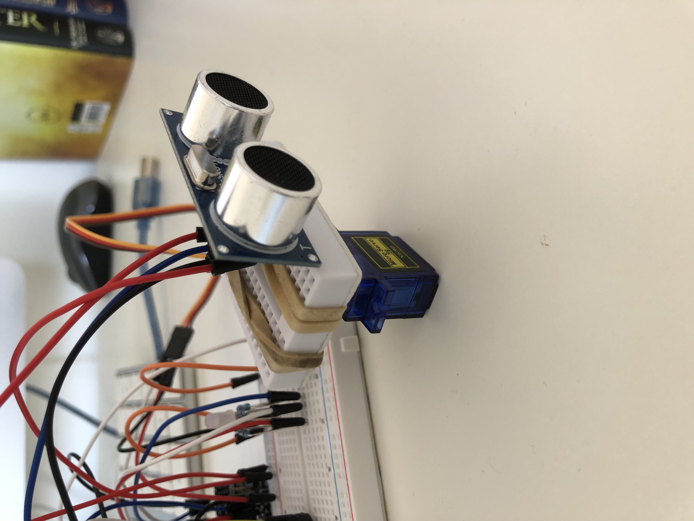
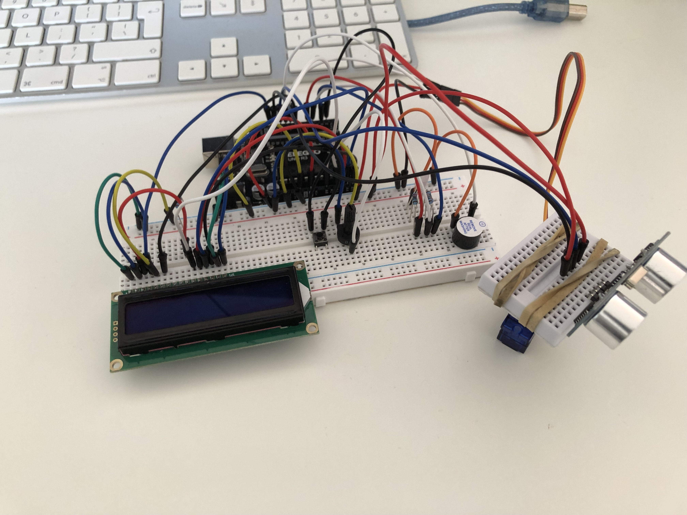
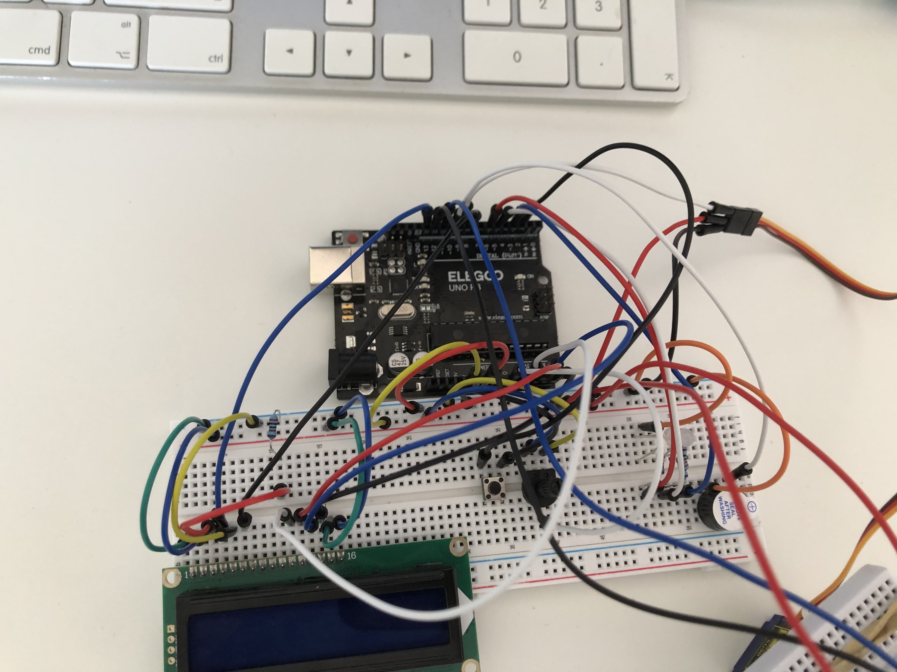

# Arduino Radar Project
I built an object detection alarm using an Arduino Uno as a first project and to consolidate knowledge and to see what I could make without using tutorials. It uses an ultrasonic sensor to detect objects and has LED and buzzer outputs. 

## Features
 - 180° radar sweep
 - Adjustable detection threshold
 - Armed/disarmed modes
 - RGB status indicator
 - Distance-dependent buzzer
 - LCD display

## Overview

A servo sweeps back and forth continuously and has an ultrasonic sensor attached to it which constantly scans 180 degrees. A mini breadboard has the ultrasonic sensor and it's wires attached to it and is placed on top of the servo and held in place with elastic bands so that the entire ultrasonic sensor can move without potentially damaging parts. It has a button to arm and disarm the system. When disarmed, the LED glows green and when armed it glows yellow. When the system is armed, it checks if any objects are within a certain threshold distance from the sensor and if it detects something, the LED turns red and the active buzzer activates. The buzzer turns on and off repeatedly while the object is within the threshold and beeps faster the closer the object is to the sensor. The threshold distance can be adjusted with the potentiometer from 5cm to 60cm.

## Demo
https://github.com/user-attachments/assets/f409847e-f27d-4b6c-b17b-862043d4f14a

*Servo sweeping back and forth with ultrasonic sensor*

https://github.com/user-attachments/assets/c070e48a-1037-4687-a631-6122cff5db94

*Demo of it being turned to armed and detecting an object*

*The ultrasonic sensor attached to the mini breadboard and connected to the servo motor*

  

*Full circuit and top down view of it*

## Parts:
 - Elegoo UNO R3 (Arduino Uno-compatible board)
 - 830 Tie-Points Breadboard
 - Servo Motor SG90
 - Ultrasonic Sensor
 - Mini Breadboard
 - Potentiometer 10k
 - Button
 - Active Buzzer
 - RGB LED
 - x3 220 ohm resistors
 - LCD1602 Module
 - 2k ohm resistor
 - Male-to-Male Jumper Wires
 - x2 Elastic Bands

## Wiring
| Component        | Pin |
| ----------------- | --- |
| Servo              | 9   |
| Buzzer             | 10  |
| RGB LED - Red      | 6   |
| RGB LED - Green    | 5   |
| RGB LED - Blue     | 3   |
| HC-SR04 Trig       | 12  |
| HC-SR04 Echo       | 11  |
| Button             | 2   |
| Potentiometer      | A0  |
| LCD RS             | 13  |
| LCD E              | 8   |
| LCD D4             | A2  |
| LCD D5             | A3  |
| LCD D6             | A4  |
| LCD D7             | A5  |
| LCD V0             | GND (via 2k ohm resistor) |

## Schematic

## Code
See [radar/radar.ino](radar/radar.ino)

## Known Issues
- ~~Servo sweep speed can't easily be adjusted since removing delay(10) in the for loop fixed the buzzer timing bug but there is now no delay when the servo moves~~ **Resolved:** added the delay(10); back into the for loop so now the speed can be controlled and everything is now working but I don't know why it works now and didn't earlier
- Servo movement becomes jumpy/inconsistent when powered by battery instead of connecting to a computer (works reliably when connected to computer over USB). This is probably due to the fact I'm using a 9V battery and it can't provide enough current for the servo motor to run consistently 

## Next
- ~~Add LCD screen to be able to see current settings (what mode it is in and threshold range)~~ **Done:** LCD1602 now works correctly
- Potentially link to computer visuals to show a radar which reflects what the sensor is detecting (probably in python)
